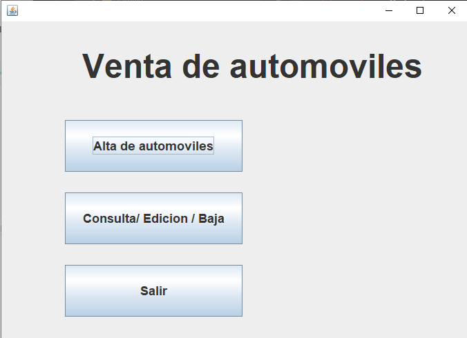
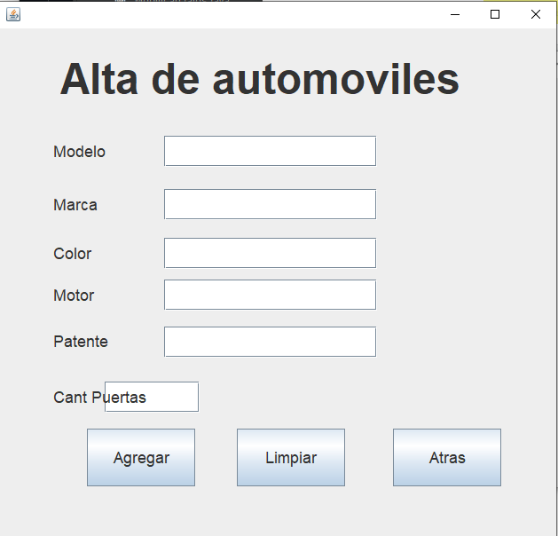
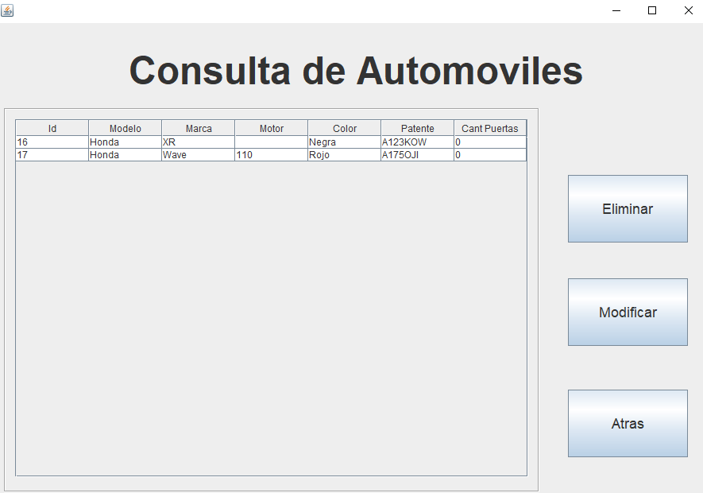
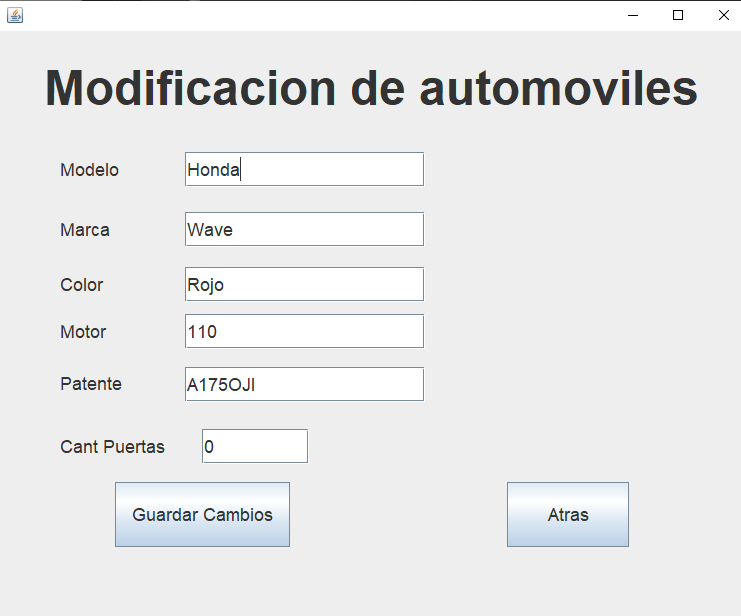
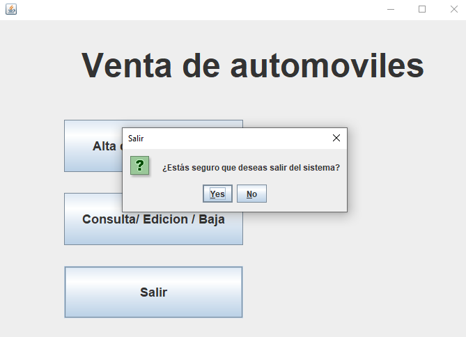

# Sistema de Gestión de Automóviles

Aplicación de escritorio desarrollada en Java utilizando Swing, JPA y Maven.

## Características
- Alta de automóviles
- Modificación de datos
- Eliminación de registros
- Consulta de automóviles
- Persistencia con JPA

## Tecnologías utilizadas
- Java
- Swing
- Maven
- JPA (Jakarta Persistence)
- MySQL

## Arquitectura
- IGU (Interfaz gráfica)
- Lógica
- Persistencia

## Screenshots

### Pantalla principal

### Carga de datos

### Visualización de datos

### Modificacion de datos

### Salida

## Cómo ejecutar
1. Clonar repositorio
2. Configurar base de datos
3. Ejecutar Maven
4. Iniciar aplicación
